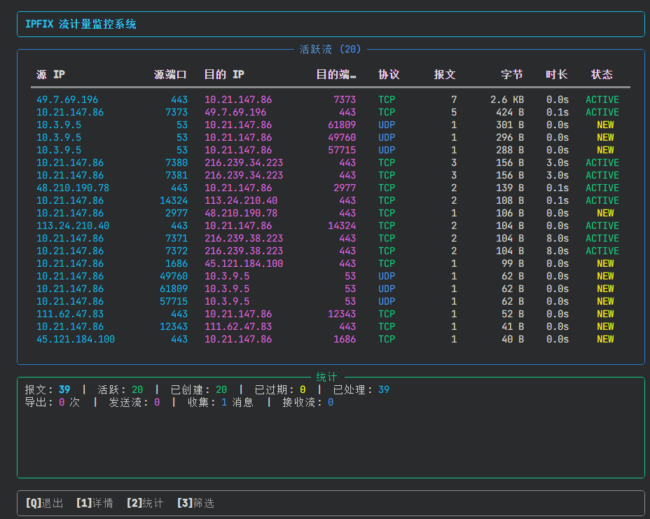
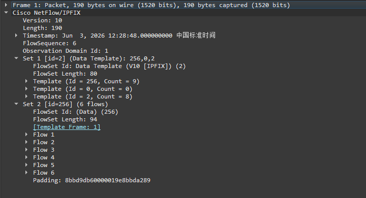
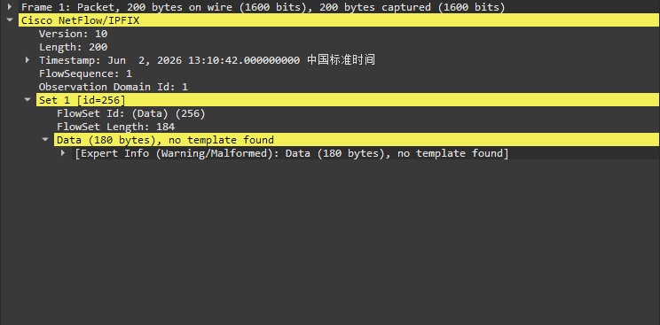

# IPFIX 流计量系统

> 基于 **RFC 7011 (IPFIX)** 标准 | Python + Scapy + Npcap | Windows

本项目是一个基于 IPFIX 标准的实时网络流量计量系统。所有内容默认采用IPFIX标准格式,适用于教学演示及IPFIX原理学习。
采用GUI界面显示流计量结果，用户可以通过界面进行筛选和操作。

---

## 功能特性

- **数据包捕获** — Scapy + Npcap 异步嗅探，BPF 过滤器，生产者-消费者 Queue 模式
- **流计量引擎** — 5-tuple 哈希流表（src_ip, dst_ip, src_port, dst_port, protocol），支持空闲/活跃/TCP FIN-RST 超时
- **IPFIX 协议** — RFC 7011 完整实现：Template Set + Data Set 二进制编码/解码
- **IPFIX 导出器** — UDP 发送至 Collector，同时写入 `.ipfix` 文件，每次运行创建独立导出目录
- **IPFIX 收集器** — 内置 UDP 监听器，接收并解码 IPFIX 消息，验证导出闭环
- **实时展现** — Rich 全屏表格，无闪烁刷新，流统计与状态实时更新
- **双层筛选** — 显示层筛选（即时生效）+ BPF 捕获层筛选（抓包级过滤）
- **交互式菜单** — 启动前筛选向导 + 运行时快捷键操作

### 环境要求

- Windows 10 / 11
- [Npcap](https://npcap.com/) 驱动
- Python 3.10+
- **管理员权限**

### 安装

```powershell
# 1. 安装 Npcap (https://npcap.com/)
# 2. 安装 Python 依赖
pip install -r requirements.txt
```

### 运行

```powershell
# 右键 PowerShell → "以管理员身份运行"
python main.py
```

启动后会进入筛选向导，可选择：
```powershell
╭───────────────────────────────────────────────────────────────────────────────────────────────────────────────╮
│ 启动筛选设置                                                                                                  │
│ 选择筛选层级后配置具体条件, 或直接运行。                                                                      │
╰───────────────────────────────────────────────────────────────────────────────────────────────────────────────╯
  [1] 显示层筛选 (控制台展现过滤)  — 无
  [2] 捕获层筛选 (BPF 抓包过滤)   — 无
  [3] 不添加, 直接运行
  
````
---

## 运行时快捷键
| 键 | 功能 | 说明 |
|----|------|------|
| `Q` | 退出系统 | 安全停止所有模块 |
| `1` | 查看流详情 | 暂停 Live，显示完整流表格（含筛选） |
| `2` | 查看系统统计 | 捕获/流表/导出/收集汇总 |
| `3` | 筛选配置 | 显示层/BPF层筛选条件设置 |
### 筛选配置菜单 (`3` 键)

| 选项 | 说明 |
|------|------|
| `1` | 显示层筛选 — 过滤控制台展现（即时生效） |
| `2` | BPF 捕获层筛选 — 过滤抓包（需重启捕获） |
| `3` | 清除全部筛选条件 |
| `4` | 以新 BPF 筛选重启捕获 |
| `X` | 返回主界面 |

---

## 配置说明

所有配置集中在 [`config/settings.py`](config/settings.py)：

```python
# 数据包捕获
CAPTURE = {
    "interface": None,       # None=自动检测, 或指定网卡名
    "bpf_filter": "ip",      # 基础 BPF: 仅捕获 IPv4
    "snap_len": 65535,
    "promisc": True,
}

# 流计量
FLOW = {
    "idle_timeout": 30,      # 空闲超时 (秒)
    "active_timeout": 300,   # 活跃超时 (秒)
    "max_flows": 10000,      # 流表最大容量
    "tcp_timeout_on_rst": True,
    "tcp_timeout_on_fin": True,
}

# IPFIX 导出
IPFIX = {
    "collector_host": "127.0.0.1",
    "collector_port": 4739,            # IPFIX 标准端口
    "export_interval": 10,             # 导出间隔 (秒)
    "observation_domain_id": 1,
    "template_id": 256,
    "template_resend_interval": 10,    # 每 N 次导出重发模板
    "export_file_enabled": True,       # 是否导出 .ipfix 文件
    "export_file_dir": "./ipfix_data", # 导出文件基础目录
}

# 展现
DISPLAY = {
    "refresh_interval": 2.0,
    "max_active_flows_show": 20,
}

# 双层筛选 (条件为空/0 即不筛选)
FILTER = {
    "display": {  # 显示层 — 过滤控制台展现
        "ip": "", "protocol": "", "src_port": 0, "dst_port": 0,
    },
    "bpf": {      # BPF层 — 过滤抓包
        "ip": "", "protocol": "", "src_port": 0, "dst_port": 0,
    },
}
```

---
## 关键参数定义

1. 本项目通过标准的五元组识别流

```python
class FlowKey(NamedTuple):
    """
    流标识五元组 — 唯一确定一条网络流
    ┌──────────────┬─────────────────────────────┐
    │ 字段         │ 说明                         │
    ├──────────────┼─────────────────────────────┤
    │ src_ip       │ 源 IPv4 地址 (字符串形式)     │
    │ dst_ip       │ 目的 IPv4 地址               │
    │ src_port     │ 源传输层端口 (0 表示无端口)    │
    │ dst_port     │ 目的传输层端口                │
    │ protocol     │ IP 协议号 (6=TCP, 17=UDP, 1=ICMP) │
    └──────────────┴─────────────────────────────┘
    """
    src_ip: str
    dst_ip: str
    src_port: int
    dst_port: int
    protocol: int
```
该定义在 [`flow/record.py`](flow/record.py) 中。使用者可以通过修改 `FlowKey` 定义来扩展或修改流识别规则。

2. 本项目在 [`ipfix/protocol.py`](ipfix/protocol.py) 中定义了 IPFIX Information Element(及 Template的结果)：

```python
# ── IPFIX Information Element 定义 (PEN=0, IE 来自 IANA) ──
# 每个 IE: (ie_id, ie_length, name)
IE_SOURCE_IPV4      = (8,   4, "sourceIPv4Address")
IE_DEST_IPV4        = (12,  4, "destinationIPv4Address")
IE_SOURCE_PORT      = (7,   2, "sourceTransportPort")
IE_DEST_PORT        = (11,  2, "destinationTransportPort")
IE_PROTOCOL         = (4,   1, "protocolIdentifier")
IE_PACKET_COUNT     = (2,   8, "packetDeltaCount")
IE_BYTE_COUNT       = (1,   8, "octetDeltaCount")
IE_FLOW_START_MS    = (152, 8, "flowStartMilliseconds")
IE_FLOW_END_MS      = (153, 8, "flowEndMilliseconds")

# Template 中 IEs 的顺序 (决定了 Data Record 中字段的排列)
TEMPLATE_IES = [
    IE_SOURCE_IPV4,
    IE_DEST_IPV4,
    IE_SOURCE_PORT,
    IE_DEST_PORT,
    IE_PROTOCOL,
    IE_PACKET_COUNT,
    IE_BYTE_COUNT,
    IE_FLOW_START_MS,
    IE_FLOW_END_MS,
]
```
使用者可以通过修改 `ipfix/protocol.py` 中的 `TEMPLATE_IES` 来扩展或修改 IPFIX Template 的结构。


## 项目结构

```
internet_config/
├── main.py                    # 主入口，线程协调 + Rich Live 展现 + 交互
├── requirements.txt           # Python 依赖 (scapy, rich, psutil)
├── .gitignore
├── README.md
│
├── config/
│   ├── __init__.py
│   └── settings.py            # 集中配置
│
├── capture/
│   ├── __init__.py
│   └── sniffer.py             # Scapy 异步抓包 + BPF 过滤器构建
│
├── flow/
│   ├── __init__.py
│   ├── record.py              # FlowKey + FlowRecord + FlowState 数据结构
│   └── meter.py               # FlowTable 流表 + FlowMeter 流计量引擎
│
├── ipfix/
│   ├── __init__.py
│   ├── protocol.py            # IPFIX 编码/解码 (RFC 7011)
│   ├── exporter.py            # IPFIX 导出器 (UDP + 文件)
│   └── collector.py           # IPFIX 收集器 (UDP 监听 + 解码)
│
└── utils/
    └── __init__.py             # 工具包 (预留)
```

---

## IPFIX 文件验证 (Wireshark)

程序运行时在 `./ipfix_data/` 下创建以时间戳命名的子目录（如 `20250603_143052/`），每次导出写入 `.ipfix` 文件。
为了方便教学演示，每个导出的文件包含 **Template Set + Data Set** 的完整 IPFIX Message，可直接用 Wireshark 打开验证：


事实上工程化的ipfix文件不会每个都包含Template Set，这会造成大量的数据浪费,而是根据实际需要定时重发。
而不包含Template Set的文件，wireshark是无法单独解析的.

## 注意事项

1. **管理员权限必需** — 数据包捕获需要管理员权限，程序启动时会自动检测
2. **Npcap 驱动** — 未安装则 Scapy 无法嗅探，程序启动会提示
3. **仅支持 IPv4** — 不支持 IPv6 流
4. **单网卡** — 默认使用系统路由接口，可通过 `CAPTURE.interface` 指定
5. **防火墙** — 首次运行可能触发 Windows 防火墙提示，需允许 Python 访问网络
